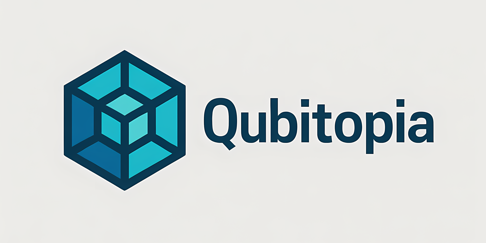

# QuantumScholar

   

   

   
   

---

> "Empowering secure, fair, and scalable online assessments with AI."

## Overview

**QuantumScholar** is an AI-based proctoring website designed to ensure secure, fair, and scalable online assessments. Leveraging advanced artificial intelligence, it provides real-time monitoring, identity verification, and automated analysis to detect suspicious activities during online exams.

## Features

- AI-powered live proctoring
- Automated identity verification
- Real-time cheating detection
- Secure user authentication
- Scalable for institutions and organizations
- Detailed reporting and analytics
